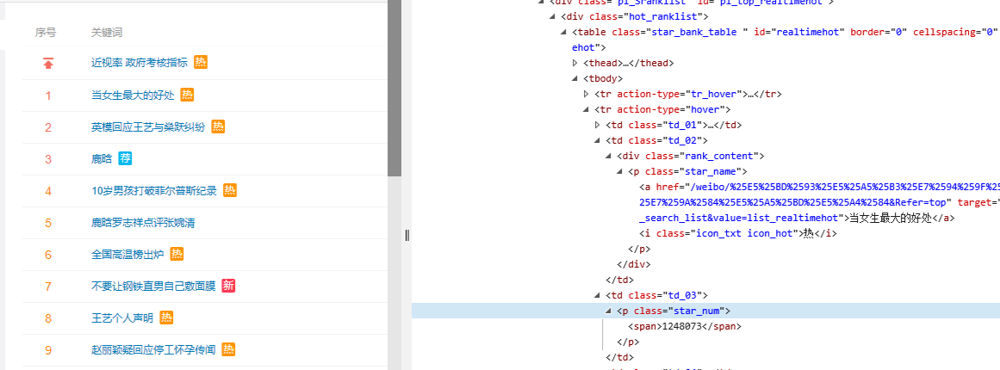

# 中期报告

# 1、主要工作进展和结果。  
## 1.1 概述  
&emsp;新浪微博是一款为大众提供娱乐休闲生活服务的信息分享和交流平台，用户可以通过多种方式发布或上传图片，关注自己喜欢的用户，对自己或他人的消息进行评论。转发自己喜欢的内容。新浪微博具有门槛低、随时随地接受和发布信息、快速传播、实时搜索等特点。根据2018年第一季度财报，截至2018年3月，微博月活跃用户数已增至4.11亿，成为全球第7家活跃用户规模突破4亿的社交产品。  
&emsp;微博实时热搜榜每1分钟更新一次，按照短时间内的搜索量进行排序。短时间内搜索量非常高、上升趋势非常快的词都有可能进榜。同时，对参与搜索的用户质量会有一定要求，另外，为了防止恶意刷榜行为，存在监测机制。

## 1.2 数据搜集  
&emsp;按照微博实时热搜榜的更新机制，我们每一分钟对微博热搜榜进行数据爬取，取出其中的热搜条目和热搜次数，并进行存储。  

### 1.2.1 html处理  
&emsp;微博热搜榜的网址为[链接到sina](http://s.weibo.com/top/summary?cate=realtimehot)，每分钟获取该网页对应的html数据，并找到显示热搜榜的代码段，
  
&emsp;如上图所示，50个热搜在<tbody>标签中，每一个热搜对应了一个<tr action-type=hover></tr>。其中，热搜条目对应了td_02，热搜次数对应了td_03。将这两部分内容进行储存。热搜条目所对应的数据为Unicode编码，需要转换为utf-8编码。  

### 1.2.2 获取和储存机制
根据微博实时热搜榜的更新说明，我们需要每1分钟获取一次热搜数据。为了避免被封锁，对获取时间进行调整，每次获取的时间间隔为60s±3s。每次获取后写入一个单独的文件。  

### 1.2.3 数据爬取源代码（java版）  
``` java
import java.io.*;
import java.net.HttpURLConnection;
import java.net.URL;
import java.util.ArrayList;

public class Main {
    public static void main(String args[]){
        try {
            new Main();
        }catch (Exception e){
            e.printStackTrace();
        }
    }

    public Main() throws Exception{
        URL url;
        HttpURLConnection connection = null;
        BufferedReader reader = null;
        String s;
        StringBuffer buffer;
        ArrayList<Object[]> content = new ArrayList<>();
        int fileNumber = 11;
        while (true) {
            try {
                url = new URL("http://s.weibo.com/top/summary?cate=realtimehot");
                connection = (HttpURLConnection) url.openConnection();
                reader = new BufferedReader(new InputStreamReader(connection.getInputStream()));

                buffer = new StringBuffer();
                while ((s = reader.readLine()) != null)
                    buffer.append(s);
                reader.close();
                connection.disconnect();
                s = buffer.toString();

                int i = s.indexOf("td_02"), j;

                String s1;
                while (true) {
                    i = s.indexOf("td_02", i + 1);
                    i = s.indexOf("suda-data", i + 1);
                    if (i == -1)
                        break;
                    i = s.indexOf(">", i + 1);
                    j = s.indexOf("<\\/a", i + 1);
                    s1 = decodeUnicode(s.substring(i + 1, j));

                    if (s1.length() > 0) {
                        i = s.indexOf("td_03", i + 1);
                        i = s.indexOf("<span>", i + 1);
                        i = s.indexOf(">", i + 1);
                        j = s.indexOf("<", i + 1);

                        content.add(new Object[]{s1, Integer.valueOf(s.substring(i + 1, j))});
                    }

                    if (content.size() >= 50)
                        break;
                }

                File file = new File("D:\\hotdata\\" + fileNumber + ".txt");
                file.createNewFile();
                FileOutputStream outputStream = new FileOutputStream(file);
                for (Object[] objects : content)
                    outputStream.write((objects[0] + "\t" + objects[1] + "\r\n").getBytes());
                outputStream.close();
                content.clear();
                fileNumber++;

                int add = Math.random() > 0.5 ? -1 : 1;
                int latency = (int) (Math.random() * 2 * 1000);
                Thread.sleep(60 * 1000 + add * latency);
            }catch (Exception e){
                System.out.println(e.toString());
                reader.close();
                connection.disconnect();
                content.clear();
                Thread.sleep(60*1000);
            }
        }
    }

    public static String decodeUnicode(String dataStr) {
        final StringBuffer buffer = new StringBuffer();
        String charStr;
        int start=dataStr.indexOf("\\u") , nextStart=dataStr.indexOf("\\u" , start+2);
        if(start==-1)
            return dataStr;
        buffer.append(dataStr.substring(0, start));
        while (start > -1) {

            if (start+6 < dataStr.length())
                charStr = dataStr.substring(start + 2, start+6);
            else
                charStr = dataStr.substring(start + 2, dataStr.length());

            char letter = (char) Integer.parseInt(charStr, 16);
            buffer.append(Character.toString(letter));
            buffer.append(dataStr.substring(start+6,nextStart<0 ? dataStr.length() : nextStart));

            start=nextStart;
            nextStart=dataStr.indexOf("\\u" , start+2);
        }
        return buffer.toString();
    }
}
```
